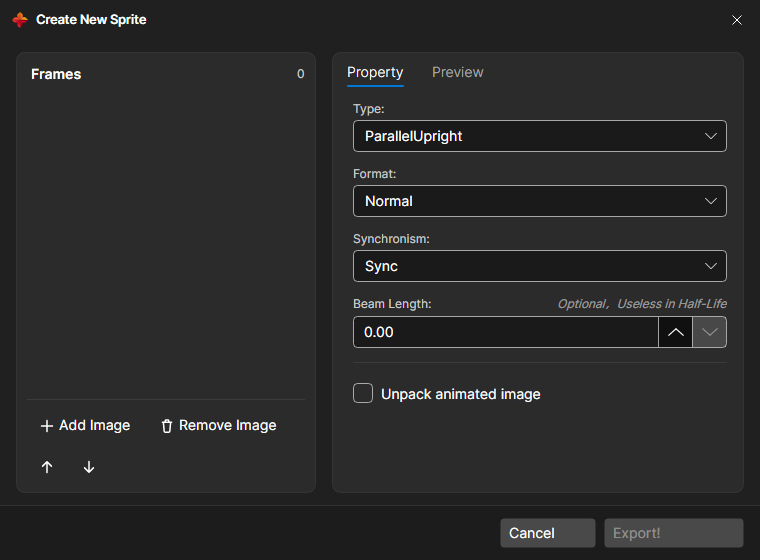
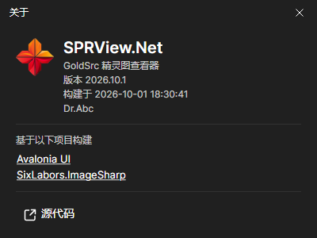

# SPRView.Net

Yet another sprite viewer for the Half-Life series games (Counter-Strike, Sven Co-op, etc.)


----
# ✅Getting Started

- [中文](READMECN.md)
-  Grab prebuild binaries from [release](https://github.com/DrAbcOfficial/SPRView.Net/releases) — x64 and arm64 for macOS/Linux, x64 for Windows — everything is published with  NativeAOT, no .NET runtime install needed
-  To build from source you need the [.NET 10 SDK](https://dotnet.microsoft.com/download/dotnet/10.0) (plus `clang` and `zlib1g-dev` on Linux)

----
# 🖼️ Screenshot

|Viewer|Create new|
|--|--|
|||

|Dark theme|Create new (dark)|
|--|--|
|||

|About|About (dark)|
|--|--|
|||


----
# 🧩 Architecture

```
src/
  SPRView.Net.Core                       spr parsing & rendering library
    ├─ Spr/         document, header, frame, palette, enums
    ├─ IO/          SprReader / SprWriter (binary format)
    ├─ Rendering/   frame decoding, image composition & quantization
    └─ Native/      C ABI exports (sprview_core.h) for NativeAOT shared lib
  SPRView.Net/                           Avalonia cross platform viewer
    ├─ Themes/      WinUI 3 design tokens, vector icons, control themes
    ├─ Window/      the four windows, caption and resize chrome
    ├─ ViewModel/   viewer / create-new / localization state
    └─ Storage/     per instance document and palette state
  SPRView.Net.CLI/                       command line tool
  SPRView.Net.Thumbnailer/               sprview-thumbnailer executable
platform/
  linux/    XDG thumbnailer entry, mime type, install scripts
  macos/    Quick Look extension sources (Swift) + install script
  windows/  Explorer shell extension (C++20 COM) + register scripts
tools/
  UiSnapshot/  renders every window headlessly to PNG for layout review
```

## 🎨 Interface

The viewer is built on one design language — WinUI 3 / Fluent 2 — rather than
the host theme, so the three platforms render identically:

- **Design tokens** in `Themes/Tokens.axaml` mirror the Fluent 2 resource
  names (`SolidBackgroundFillColorBaseBrush`, `TextFillColorPrimaryBrush`,
  `AccentFillColorDefaultBrush`, …) with a light and a dark table; the app
  follows the OS theme and gets correct contrast in both.
- **Icons** in `Themes/Icons.axaml` are hand-drawn `StreamGeometry` on a 20×20
  grid. No emoji and no platform icon fonts, because neither is available
  everywhere.
- **Chrome** is app-drawn: the caption, the command bar and the resize grips
  come from `Window/WindowChrome.cs`, so the window looks the same instead of
  picking up the native title bar on each OS.
- **Layout** is a caption, a command bar, a checkerboard canvas, a side panel
  and a transport bar. The side panel starts collapsed so the sprite gets the
  whole window; the leftmost command bar toggle brings it back. Inside it the
  information and palette sections collapse from their own headers, so a 256
  colour palette can take the whole panel when the metadata is not what you are
  looking at. The command bar itself starts on icons and only spells its labels
  out once the window is wide enough that they cannot clip.
- **Zooming** fits small sprites to the canvas on whole-number steps, so pixel
  art stays sharp instead of blurring on a fractional scale.
- **Versioning** is one file: `version.txt` at the repository root. MSBuild
  bakes it, together with the build timestamp, into every binary, and the About
  dialog reads them back from the assembly, so a published single file build
  still reports where it came from. Pass `-p:IncludeBuildTime=false` for a
  reproducible build.
- **Transparency** is applied per the sprite format by default. The toggle in
  the command bar turns that off to show the frames exactly as the file stores
  them, background and all, which is what you want when checking what an artist
  painted underneath the artwork.

`tools/UiSnapshot` renders every window off screen in both themes, which is how
the layout is reviewed without a desktop session:

```sh
dotnet run --project tools/UiSnapshot -- <output dir> [file.spr] [lang]
```

`SPRView.Net.Core` is the single implementation of the GoldSrc sprite format.
It is consumed as a managed library by the GUI, CLI and thumbnailer, and can
also be published as a native shared library exporting a plain C ABI:

```sh
dotnet publish src/SPRView.Net.Core -c Release -r <rid> -p:NativeLib=Shared -p:PublishAot=true
# -> sprview_core.dll / .so / .dylib, see src/SPRView.Net.Core/Native/sprview_core.h
```

All three platform thumbnail providers sit under `platform/` and share that
C ABI: the Windows Explorer extension is an independent C++20 project that
loads `sprview_core.dll` at runtime, and the macOS QuickLook extension calls
the same library (or shells out to `sprview-thumbnailer`).

# ⌨️ Command line

`SPRView.Net.CLI` ships in the release archive as a self contained binary and
covers everything the viewer does without a display:

```sh
SPRView.Net.CLI information <file.spr>              # header and palette
SPRView.Net.CLI preview     <file.spr> [-s size] [-f frame]
SPRView.Net.CLI image       <file.spr> <out> [-f format]
SPRView.Net.CLI thumbnail   <file.spr> [-o out]     # base64 unless -o is given
SPRView.Net.CLI create      <images> <w> <h> <out> [-t type] [-f format]
```

`create` takes a comma separated list of images and packs them into a sprite;
`-t` selects the render type, `-f` the blend format, and `-u` splits animated
inputs into single frames. `image` writes any format ImageSharp supports
(`.png .bmp .jpg .tga .gif .webp .tiff .qoi`).

The same command line drives the compositing the GUI uses, so a sprite built
here opens in the viewer and in the engine.

# 🖼️ Thumbnail providers

Double-click viewing is not the only way to see a sprite any more — file
manager thumbnails are supported on all three platforms:

- **Windows** — run `install.ps1 -DllPath .\sprview-thumbnailer-win.dll`
  from the release archive to register the Explorer thumbnail handler for
  `.spr` (HKCU, no admin needed); `uninstall.ps1` removes it. The extension
  is a C++20 COM dll; see
  [thumbnail-provider/README.md](platform/windows/thumbnail-provider/README.md)
  to build it.
- **Linux (XDG)** — `sudo ./thumbnailer-linux/install.sh` installs the
  `sprview-thumbnailer` binary plus the XDG thumbnailer entry and the
  `application/x-spr` mime type; `--user` installs to `~/.local` instead.
- **macOS (Quick Look)** — install the renderer with
  `sudo ./thumbnailer-macos/install.sh`, then follow
  [thumbnailer-macos/quicklook/README.md](platform/macos/quicklook/README.md)
  to build the Quick Look extension in Xcode.


----

# ❓️Why

- My favourite tool is too old.
- Newer tools I don't like.
- The newer tools that I like are too ugly.
- And no cross-platform

# 💡Function

This tool only provides the function to double-click and view spr, and more likely will not add the function to view/make a `wad`, view/make a `pak`, etc.

If you need, I recommend the following repositories:

- [GIMP-hl-sprite-plugin](https://github.com/Psycrow101/GIMP-hl-sprite-plugin)
- [HL-Texture-Tools](https://github.com/yuraj11/HL-Texture-Tools)
- [WadMaker](https://github.com/pwitvoet/wadmaker)


# 📄 License

This project's own code is **LGPL-3.0-or-later**. See
[LICENSE-NOTICE.md](LICENSE-NOTICE.md) for exactly what that covers, and what it
does not: the dependencies keep their own terms, and one of them
(SixLabors.ImageSharp) is not a plain permissive license.

[LICENSE](LICENSE) holds the LGPL-3.0 text and
[LICENSE.GPL-3.0.txt](LICENSE.GPL-3.0.txt) the GPL-3.0 text the LGPL
incorporates, both unmodified as published by the FSF.

# This repository used:

1. [AvaloniaUI](https://avaloniaui.net/)
2. [ImageSharp](https://github.com/SixLabors/ImageSharp)
3. [.NET 10 / C# 14 / NativeAOT](https://learn.microsoft.com/dotnet/core/deploying/native-aot/)