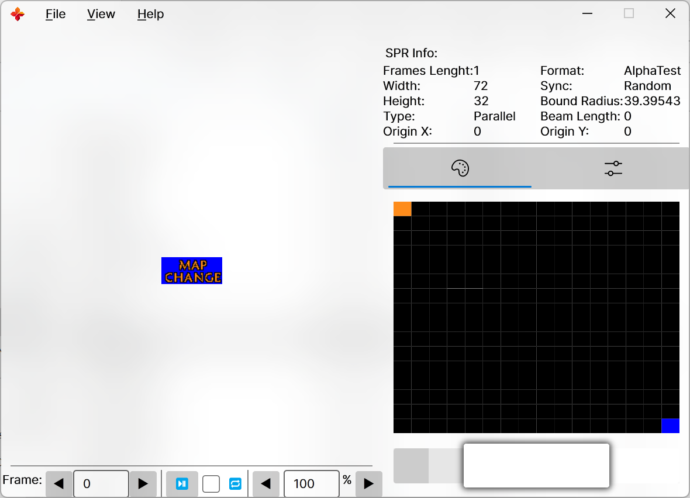

# SPRView.Net

Yet another Sprite viewer for half-life series game (counter-strike, sven co-op, etc.)

----

# ❓️Why

- My favourite tool is too old.
- Newer tools I don't like.
- The newer tools that I like are too ugly.
- And no cross-platform

# 💡Ability

This tool only provides the ability to double-click and then view the spr, and more likely than not, it will not add the ability to make a spr, view/make a wad, view/make a pak, etc.

If you need to make spr, I recommend the following repositories:

- [GIMP-hl-sprite-plugin](https://github.com/Psycrow101/GIMP-hl-sprite-plugin)
- [HL-Texture-Tools](https://github.com/yuraj11/HL-Texture-Tools)

# 🖼️ Images

# This repository used:

1. [AvaloniaUI](https://avaloniaui.net/)
2. [ImageSharp](https://github.com/SixLabors/ImageSharp)