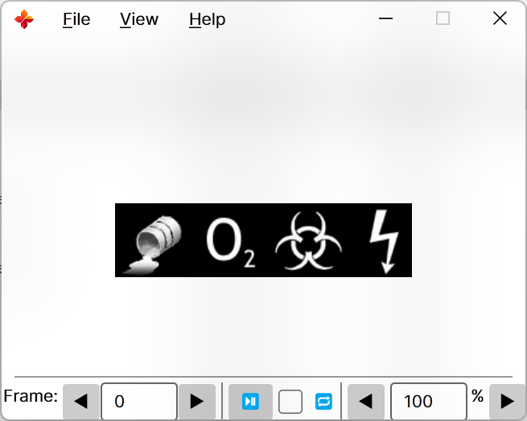

# SPRView.Net

Yet another Sprite viewer for half-life series game (counter-strike, sven co-op, etc.)

----
# ✅Getting Start

- [中文](READMECN.md)
-  Before you use this, will need install [.NET 8.0](https://aka.ms/get-dotnet-8) runtimes
-  Grab prebuild binary from [release](https://github.com/DrAbcOfficial/SPRView.Net/releases), x64 only

----

# ❓️Why

- My favourite tool is too old.
- Newer tools I don't like.
- The newer tools that I like are too ugly.
- And no cross-platform

# 💡Function

This tool only provides the function to double-click and view spr, and more likely will not add the function to view/make a `wad`, view/make a `pak`, etc.

If you need, I recommend the following repositories:

- [GIMP-hl-sprite-plugin](https://github.com/Psycrow101/GIMP-hl-sprite-plugin)
- [HL-Texture-Tools](https://github.com/yuraj11/HL-Texture-Tools)
- [WadMaker](https://github.com/pwitvoet/wadmaker)

# 🖼️ Screenshot

|1|2|
|--|--|
|||

# This repository used:

1. [AvaloniaUI](https://avaloniaui.net/)
2. [ImageSharp](https://github.com/SixLabors/ImageSharp)