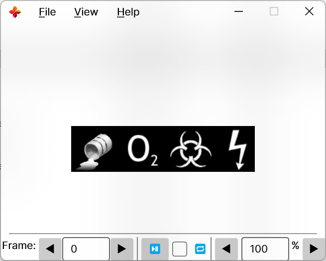
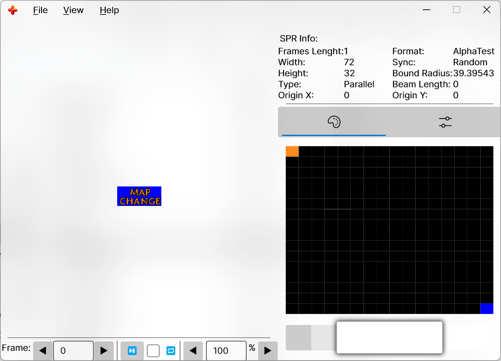

# SPRView.Net

是的又是一个 half-life 系列游戏 (counter-strike, sven co-op, etc.) spr查看器

----
# ✅开始

-  在使用之前你需要安装 [.NET 8.0](ttps://aka.ms/get-dotnet-8) 运行时
-  从 [release](https://github.com/DrAbcOfficial/SPRView.Net/releases)获得预先编译的二进制文件，仅提供x64架构

----

# ❓️为什么

- 我最喜欢的工具太老
- 较新的工具我不喜欢
- 较新我又喜欢的太丑
- 而且基本都不跨平台

# 💡功能

这个工具只提供双击后查看spr的能力, 所以以后大概率不会替换类似于查看/制作 `wad`, `pak`, 之类文件的功能.

如果你有需求我推荐使用:

- [GIMP-hl-sprite-plugin](https://github.com/Psycrow101/GIMP-hl-sprite-plugin)
- [HL-Texture-Tools](https://github.com/yuraj11/HL-Texture-Tools)
- [WadMaker](https://github.com/pwitvoet/wadmaker)

# 🖼️ 截图

|1|2|
|--|--|
|||

# 第三方库:

1. [AvaloniaUI](https://avaloniaui.net/)
2. [ImageSharp](https://github.com/SixLabors/ImageSharp)