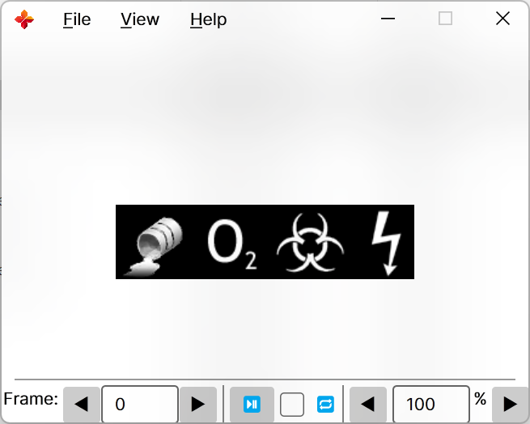
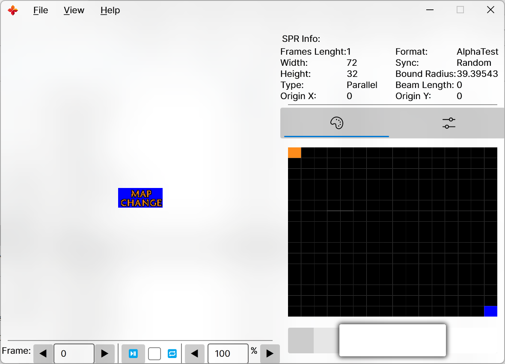

# SPRView.Net

是的又是一个 half-life 系列游戏 (counter-strike, sven co-op, etc.) spr查看器


----
# ✅开始

-  从 [release](https://github.com/DrAbcOfficial/SPRView.Net/releases)获得预先编译的二进制文件：macOS/Linux 提供 x64 与 arm64，Windows 提供 x64。所有产物均以  NativeAOT 编译为原生代码，无需安装 .NET 运行时
-  从源码构建需要 [.NET 10 SDK](https://dotnet.microsoft.com/download/dotnet/10.0)（Linux 上还需要 `clang` 和 `zlib1g-dev`）

----
# 🧩 架构

```
src/
  SPRView.Net.Core                       spr 解析与渲染核心库
    ├─ Spr/         文档、文件头、帧、调色板、枚举
    ├─ IO/          SprReader / SprWriter（二进制格式）
    ├─ Rendering/   帧解码、图像合成与量化
    └─ Native/      C ABI 导出（sprview_core.h），可发布为原生共享库
  SPRView.Net/                           Avalonia 跨平台查看器
  SPRView.Net.CLI/                       命令行工具
  SPRView.Net.Thumbnailer/               sprview-thumbnailer 可执行程序
platform/
  linux/    XDG thumbnailer 入口、MIME 类型、安装脚本
  macos/    Quick Look 扩展源码（Swift）+ 安装脚本
  windows/  Explorer 缩略图扩展（C++20 COM）+ 注册脚本
```

`SPRView.Net.Core` 是 GoldSrc sprite 格式的唯一实现。GUI、CLI 和缩略图程序
以托管库方式引用它；它还可以发布为导出纯 C ABI 的原生共享库：

```sh
dotnet publish src/SPRView.Net.Core -c Release -r <rid> -p:NativeLib=Shared -p:PublishAot=true
# -> sprview_core.dll / .so / .dylib，接口见 src/SPRView.Net.Core/Native/sprview_core.h
```

三个平台的缩略图提供者都位于 `platform/` 并共享该 C ABI：Windows Explorer
扩展是独立的 C++20 工程，运行时加载 `sprview_core.dll`；macOS QuickLook
扩展调用同一库（或调起 `sprview-thumbnailer`）。

# 🖼️ 缩略图支持

除了双击查看，三大平台的文件管理器缩略图也已支持：

- **Windows** — 在发布包中执行 `install.ps1 -DllPath .\sprview-thumbnailer-win.dll`
  注册 Explorer 缩略图处理器（写入 HKCU，无需管理员）；`uninstall.ps1` 卸载。
  扩展是 C++20 COM DLL，构建说明见
  [thumbnail-provider/README.md](platform/windows/thumbnail-provider/README.md)。
- **Linux (XDG)** — `sudo ./thumbnailer-linux/install.sh` 安装
  `sprview-thumbnailer`、XDG thumbnailer 入口和 `application/x-spr` MIME 类型；
  加 `--user` 则安装到 `~/.local`。
- **macOS (Quick Look)** — 先 `sudo ./thumbnailer-macos/install.sh` 安装渲染器，
  再按 [thumbnailer-macos/quicklook/README.md](platform/macos/quicklook/README.md)
  在 Xcode 中构建 Quick Look 扩展。


----

# ❓️为什么

- 我最喜欢的工具太老
- 较新的工具我不喜欢
- 较新我又喜欢的太丑
- 而且基本都不跨平台

# 💡功能

这个工具只提供双击后查看spr的能力, 所以以后大概率不会替换类似于查看/制作 `wad`, `pak`, 之类文件的功能.

如果你有需求我推荐使用:

- [GIMP-hl-sprite-plugin](https://github.com/Psycrow101/GIMP-hl-sprite-plugin)
- [HL-Texture-Tools](https://github.com/yuraj11/HL-Texture-Tools)
- [WadMaker](https://github.com/pwitvoet/wadmaker)

# 🖼️ 截图

|1|2|
|--|--|
|||


# 第三方库:

1. [AvaloniaUI](https://avaloniaui.net/)
2. [ImageSharp](https://github.com/SixLabors/ImageSharp)
3. [.NET 10 / C# 14 / NativeAOT](https://learn.microsoft.com/dotnet/core/deploying/native-aot/)